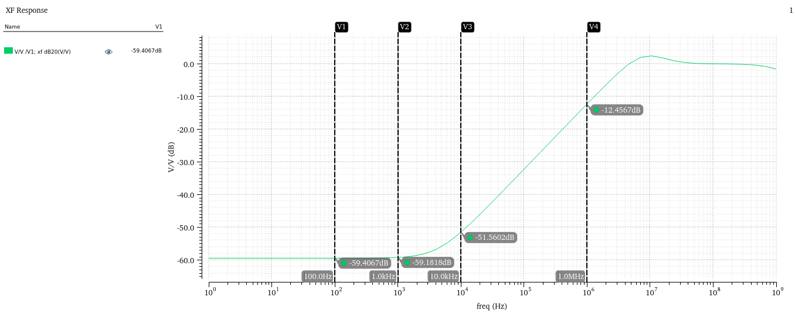

# 🏗 CMOS Low Dropout (LDO) Regulator Design – 180nm

## Table of Contents
- [Overview](#overview)
- [Key Specifications](#key-specifications)
- [Design and Implementation](#design-and-implementation)
  - [Bandgap Reference (BGR)](#1-bandgap-reference-bgr)
  - [Folded Cascode Error Amplifier](#2-folded-cascode-error-amplifier)
  - [Pass Device](#3-pass-device)
  - [Feedback Network](#4-feedback-network)
- [Simulation Results](#simulation-results)
  - [BGR Output Characteristics](#bgr-output-characteristics)
  - [STB Analysis (Loop Gain & PSRR)](#stb-analysis)
  - [Line & Load Regulation](#line--load-regulation)
  - [PVT Analysis](#pvt-analysis)
- [Layout](#layout)
- [Applications](#applications)
- [Learnings & Takeaways](#learnings--takeaways)
- [References](#references)

---

## Overview
This project focuses on the design of a **CMOS Low Dropout (LDO) Regulator** in **180nm technology**.  
The objective is to regulate the input supply of **1.8 V** to a stable output of **1.5 V**, with a dropout voltage of **0.3 V** and load current up to **100 mA**.

The design targets:
- **High PSRR** across frequency
- **Fast transient response** for sudden load changes
- **Stable operation** across process corners and temperature variations

### Complete System Schematic

---

## Key Specifications
| Parameter           | Target Value         |
|--------------------|--------------------|
| Input Voltage (Vdd) | 1.8 V             |
| Output Voltage (Vout) | 1.5 V           |
| Dropout Voltage     | ≤ 0.3 V           |
| Load Current        | 100 mA             |
| PSRR @ 1 kHz       | > 50 dB           |
| Phase Margin       | > 60°             |

---

## Design and Implementation

### 1. Bandgap Reference (BGR)
- Provides a **temperature-independent reference voltage** for vref.
- Implemented using **PTAT + CTAT combination**.
- Implemented **Current Mode** BGR for generating constant 0.9V.

---

### 2. Folded Cascode Error Amplifier
- Chose **PMOS Input** Folded cascode architecture for better noise suppression.
- Chosen for **high DC gain** and **wide output swing**.
- Folded cascode has only one dominant pole hence best suited for this application.

---

### 3. Pass Device
- Implemented using a PMOS transistor as the series pass element for low dropout voltage.
- Size chosen to minimize **Rds(on)** and **keep the device in saturation**.

---

### 4. Feedback Network
- **Resistive divider** used to scale down Vout.
- Divider ratio selected to set Vout = 1.5 V.

---

## Simulation Results

### BGR Output Characteristics
- **Vref vs Temperature** shows excellent temperature stability.
- opserved variation of only upto **8 PPM**.

---

### STB Analysis (Loop Gain & PSRR)
- Loop gain simulated to verify **gain > 60 dB** and **phase margin > 60°**.
- PSRR simulated at multiple frequencies to ensure supply noise rejection.

  

---

### Line & Load Regulation
- **Line Regulation:** Swept input voltage from 1.0 V to 3.0 V and observed Vout variation.
- **Load Regulation:** Swept load current from no-load to full-load and observed output voltage droop.

  

### PVT Analysis
To ensure robust operation across all process, voltage, and temperature corners, a comprehensive **PVT analysis** was performed.

- **Process Corners:** Simulated across TT, FF, SS, SF, FS process corners.
- **Temperature Range:** Simulated from **-40°C to 125°C**.

#### Key Observations:
- **Loop Gain & Phase Margin:** Remained >60° across all PVT corners ensuring stability.
- **PSRR:** Maintained >50 dB up to 1 kHz even in worst-case corner.
- **Line Regulation:** Output variation was within ±2% across voltage corners.

  ##### Plots
  
  
  

---

## Layout
- **Common-centroid layout** used for Mosfets to minimize mismatch.
- **Guard rings** around sensitive nodes to reduce substrate noise coupling.
- **Symmetrical placement** of devices to minimize gradient effects.
- **Mesh routing** used for pass device to minimize IR drop and electromigration risk.

---

## Applications
- On-chip power management for analog and digital blocks
- Portable and battery-operated devices
- IoT sensor nodes with strict power budgets

---

## Learnings & Takeaways
- Designed and simulated **Bandgap Reference** with excellent temperature stability.
- Implemented **PMOS input folded cascode** for improved gain and PSRR.
- Learned **layout matching techniques** (common-centroid, interdigitation, guard rings).
- Performed **PVT analysis** to ensure robust performance and stability.
- Gained experience in **frequency compensation** and **loop stability verification**.

---

## References
- Chen - *Power Management Techniques for Integrated Circuit Design*
- Razavi – *Design of Analog CMOS Integrated Circuits*

---

## 📫 Contact Me
If you have any questions, feedback, or suggestions, feel free to connect with me:

- **LinkedIn:** [Abhay Kaisare](https://www.linkedin.com/in/abhay-kaisare-41172b261/)
- **Email-id :** [Abhay Kaisare](kaisareab@gmail.com)

---

## ⭐ Support This Project
If you found this project helpful, please give it a **star ⭐** on GitHub — it helps others discover it and motivates me to keep improving.

